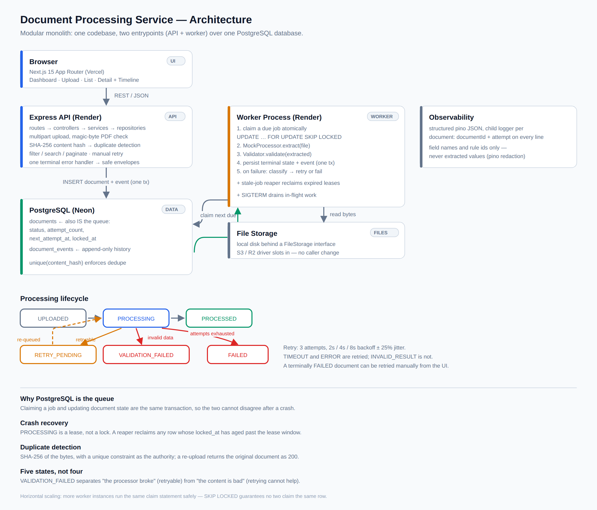

# Technical Documentation

The architecture, API reference, design reasoning and engineering answers for the
Document Processing Service.

For what the service is, the tech stack, and how to run it, see the
[README](../README.md).

| | |
| --- | --- |
| **Live demo** | **https://document-scanner-jet.vercel.app** |
| API | https://document-scanner-api-2g4r.onrender.com/api |

---

## Table of Contents

- [Architecture](#architecture)
- [Data Model](#data-model)
- [Processing Lifecycle](#processing-lifecycle)
- [Design Decisions](#design-decisions)
- [API Reference](#api-reference)
- [Frontend](#frontend)
- [Observability](#observability)
- [Testing Strategy](#testing-strategy)
- [Deployment](#deployment)
- [Engineering Questions](#engineering-questions)
- [Limitations](#limitations)

---

## Architecture



A modular monolith. One codebase, two entrypoints: an API process and a worker
process. They share domain services, the Prisma client, and the queue definition.

```
                        ┌────────────────────────────────┐
                        │        Browser (user)          │
                        └───────────────┬────────────────┘
                                        │ HTTPS
                        ┌───────────────▼────────────────┐
                        │   Next.js Frontend  (Vercel)   │
                        │  Dashboard · Upload · List     │
                        │  Detail + Processing Timeline  │
                        └───────────────┬────────────────┘
                                        │ REST / JSON
                        ┌───────────────▼────────────────┐
                        │   Express API   (Render)       │
                        │                                │
                        │  routes → controllers →        │
                        │  services → repositories       │
                        │                                │
                        │  · multipart upload + hashing  │
                        │  · duplicate detection         │
                        │  · query / filter / paginate   │
                        │  · manual retry trigger        │
                        └───────────────┬────────────────┘
                                        │
                          INSERT document (status=UPLOADED,
                          next_attempt_at=NOW()) + event,
                          in one transaction
                                        │
              ┌─────────────────────────▼─────────────────────────┐
              │                PostgreSQL  (Neon)                 │
              │                                                   │
              │   documents         ← also serves as the queue:   │
              │     status, attempt_count,                        │
              │     next_attempt_at, locked_at                    │
              │   document_events   ← append-only history         │
              └─────────────────────────▲─────────────────────────┘
                         │                          │
        claim next due   │                          │ write terminal state
        FOR UPDATE       │                          │ + append event
        SKIP LOCKED      │                          │
              ┌──────────┴──────────────────────────┴─────────────┐
              │            Worker Process  (Render)               │
              │                                                   │
              │   1. claim a due job atomically → PROCESSING      │
              │   2. MockProcessor.extract(file)                  │
              │   3. Validator.validate(extracted)                │
              │   4. persist result, append terminal event        │
              │   5. on failure: classify → schedule retry or fail│
              │                                                   │
              │   + stale-job reaper: reclaim documents stuck     │
              │     in PROCESSING past the lease window           │
              └──────────────────────┬────────────────────────────┘
                                     │ read bytes
                       ┌─────────────▼──────────────┐
                       │  File Storage              │
                       │  local disk                │
                       │  S3/R2-ready interface     │
                       └────────────────────────────┘
```

### Why a monolith

At this scale, splitting the API and worker into separately deployed services
with independent databases would add network failure modes, distributed
transactions, and deployment complexity without buying anything. Running them as
two processes over one database and one queue gives the property that actually
matters — the API stays responsive while processing happens elsewhere, and
workers scale horizontally on their own — while keeping a single migration path
and a single source of truth.

The module boundaries are drawn so that extraction could later become its own
service: the worker talks to the processor through an interface, not a function
call graph.

### Backend layering

Strictly one-directional. Routes never touch the database; services never see
`req` or `res`.

```
src/
├── server.ts                    # API entrypoint — buildApp().listen()
├── worker.ts                    # worker entrypoint — polling loop + reaper
├── app.ts                       # buildApp(): Express app, no listen (testable)
├── config/
│   ├── env.ts                   # zod-parsed process.env, fails fast at boot
│   ├── db.ts                    # Prisma client singleton
│   ├── logger.ts                # pino + redaction of document contents
│   └── queue.ts                 # JobQueue interface + Postgres implementation
├── routes/
│   ├── index.ts                 # mounts /api/documents, /api/health
│   ├── health.routes.ts         # liveness + queue depth
│   └── documents.routes.ts      # router + validation middleware only
│                                #   note: /stats is registered before /:id
├── controllers/
│   └── documents.controller.ts  # req → DTO, call service, shape response
├── services/
│   ├── documents.service.ts     # upload, dedupe, query, manual retry
│   └── processing.service.ts    # the state machine (used by the worker)
├── repositories/
│   ├── documents.repo.ts
│   └── events.repo.ts
├── processing/
│   ├── mock-processor.ts        # deterministic-by-hash mock extraction
│   ├── validator.ts             # Zod rules over extracted fields
│   └── error-classifier.ts      # which failures are retryable
├── storage/
│   └── file-storage.ts          # interface + disk implementation
├── middleware/
│   ├── upload.ts                # multer: memory storage, 10MB, PDF filter
│   ├── validate.ts              # zod schema → 400 with field errors
│   ├── request-context.ts       # correlationId via AsyncLocalStorage
│   ├── error-handler.ts         # single terminal 4-arg handler
│   └── not-found.ts
└── common/
    ├── errors.ts                # AppError hierarchy with stable codes
    ├── async-handler.ts
    └── types.ts
```

`buildApp()` returning an app **without** calling `listen()` is deliberate: it is
what lets Supertest drive the full middleware stack in integration tests without
binding ports.

---

## Data Model

### `documents`

| Column | Type | Notes |
| --- | --- | --- |
| `id` | `text` PK | `DOC-<nanoid>` — human-readable, URL-safe |
| `filename` | `text` | original upload name |
| `mime_type` | `text` | verified, not trusted from the client |
| `size_bytes` | `integer` | |
| `document_type` | `enum` | `FINANCIAL_STATEMENT`, `BANK_STATEMENT`, `REGISTRATION_CERTIFICATE`, `TAX_RETURN`, `OTHER` |
| `content_hash` | `char(64)` | SHA-256 of file bytes — **unique index** |
| `storage_key` | `text` | opaque handle from the storage interface |
| `status` | `enum` | `UPLOADED`, `RETRY_PENDING`, `PROCESSING`, `PROCESSED`, `VALIDATION_FAILED`, `FAILED` |
| `attempt_count` | `integer` | incremented per processing attempt |
| `next_attempt_at` | `timestamptz` null | when this document becomes claimable; drives retry backoff |
| `locked_at` | `timestamptz` null | lease timestamp set on claim; used by the stale-job reaper |
| `failure_reason` | `text` null | stable code, never a stack trace |
| `extracted_data` | `jsonb` null | processor output |
| `validation_errors` | `jsonb` null | `[{ field, rule, message }]` |
| `metadata` | `jsonb` | client-supplied, free-form |
| `created_at` | `timestamptz` | |
| `updated_at` | `timestamptz` | also serves as the lease timestamp |

**Indexes:** unique on `content_hash`; b-tree on `status`, `document_type`,
`created_at DESC`; a partial index on `(next_attempt_at)` where the status is
claimable, which is the queue's hot path; trigram on `filename` for search.

### `document_events` (append-only)

| Column | Type | Notes |
| --- | --- | --- |
| `id` | `bigserial` PK | |
| `document_id` | `text` FK | cascade on delete |
| `status` | `enum` | the status entered at this point |
| `attempt` | `integer` null | which processing attempt |
| `reason` | `text` null | stable failure code |
| `detail` | `jsonb` null | validation errors, duration, context |
| `created_at` | `timestamptz` | |

This table **is** the history endpoint. Nothing is ever updated or deleted, so
the record of what happened cannot drift from what the document row says now.
Every state change writes the document row and its event in one transaction.

---

## Processing Lifecycle

```
                    upload accepted
                          │
                          ▼
                    ┌───────────┐
                    │ UPLOADED  │──────────┐
                    └─────┬─────┘          │ enqueued
                          │                │
                          ▼                │
                    ┌────────────┐         │
              ┌────►│ PROCESSING │◄────────┘
              │     └─────┬──────┘
              │           │
              │     ┌─────┴──────────────────────┐
              │     │                            │
    retryable │     ▼                            ▼
    (attempts │  extraction                 extraction
     remain)  │   failed                      succeeded
              │     │                            │
              │     │                            ▼
              │     │                      ┌──────────┐
              │     │                      │ validate │
              │     │                      └────┬─────┘
              │     │                           │
              │     │              ┌────────────┴────────────┐
              │     │              │                         │
              │     │            passes                    fails
              │     │              │                         │
              │     │              ▼                         ▼
              │     │       ┌─────────────┐      ┌────────────────────┐
              │     │       │  PROCESSED  │      │ VALIDATION_FAILED  │
              │     │       └─────────────┘      └────────────────────┘
              │     │          terminal              terminal, no retry
              │     │
              └─────┤ attempts remain
                    │
                    │ attempts exhausted
                    ▼
               ┌──────────┐
               │  FAILED  │  terminal — manual retry available
               └──────────┘
```

### Five states, not four

The brief names `PROCESSED` and `FAILED`, but section 4 requires that invalid
extracted data "should not simply be marked as successfully processed." A fifth
state, `VALIDATION_FAILED`, is introduced to separate two genuinely different
situations:

- **`FAILED`** — the *processor* broke: a timeout or an internal error. The
  document itself may be perfectly fine. Retrying is sensible.
- **`VALIDATION_FAILED`** — the processor worked correctly and the *content* is
  bad: a missing registration number, a negative revenue figure. Retrying is
  pointless because the same input deterministically produces the same output.
  This needs a human.

Collapsing these into one state would mean burning three retries on documents
that can never succeed, and would leave operators unable to tell "our processor
is unhealthy" from "brokers are sending us bad documents" — two problems with
completely different responses.

---

## Design Decisions

### Duplicate detection: SHA-256 content hash

**Chosen** because it is the only candidate that identifies the same *bytes*
regardless of how the file arrived. Filename + size produces false positives (two
different `statement.pdf` files of similar size) and false negatives (the same
file renamed).

The hash is computed from the in-memory buffer during upload, before the file is
persisted, and a unique database constraint enforces it — so two concurrent
uploads of the same file cannot both win.

**Behaviour on collision:** the API returns `200 OK` with the *existing*
`documentId` and `duplicate: true`, not an error. Re-uploading is treated as an
idempotent operation rather than a client mistake; the user sees a clear
"already uploaded" state linking to the original document.

**Known limit:** this catches byte-identical duplicates only. The same underlying
document re-scanned or re-exported produces different bytes and will not be
caught. True semantic deduplication would use a business key from the extracted
data — `registrationNumber` + `documentDate` — which is only available *after*
processing. That is noted as future work rather than implemented, because it
changes duplicate detection from a synchronous upload-time check into an
asynchronous post-processing merge.

### Retry policy

| Processor outcome | Retried | Reasoning |
| --- | --- | --- |
| `SUCCESS` | — | |
| `TIMEOUT` | Yes | Transient — slow downstream, resource contention |
| `ERROR` | Yes | Assumed transient; conservative default |
| `INVALID_RESULT` | **No** | Deterministic — the same input yields the same invalid output |

**Three attempts total**, exponential backoff of 2s → 4s → 8s with jitter. Jitter
matters because a burst of uploads failing together would otherwise retry in
lockstep and re-create the same load spike.

After exhaustion the document becomes terminally `FAILED` with a stable
`failure_reason` and is no longer claimable by the worker, and the UI exposes a
**manual retry** that resets the attempt counter and makes it due again. Automatic retries handle transient faults; manual retry handles the
case where an operator has fixed the underlying problem.

### Why a Postgres-backed queue

The obvious choice would be a dedicated queue such as BullMQ on Redis. This
project uses PostgreSQL itself as the queue instead, for three reasons.

**It removes a datastore without removing a capability.** Durability, retry
scheduling, backoff, concurrent workers, and crash recovery are all still
present — they are columns and queries rather than library configuration. The
document row already carries `status` and `attempt_count`; adding
`next_attempt_at` and `locked_at` makes it a work queue.

**It makes the queue and the domain state transactional together.** With an
external queue, marking a document `PROCESSED` and acknowledging its job are two
writes to two systems, and a crash between them leaves the two disagreeing.
Here, claiming a job and updating document state happen in the same database —
so the "did this job run?" question always has exactly one answer.

**It costs nothing to host.** The free Redis options are a poor fit for this
workload: Render's free Key Value instance has no persistence and loses all data
on restart, which would silently drop queued jobs, and Upstash's free plan bills
per command while BullMQ polls Redis continuously even when idle — an always-on
worker would consume the monthly budget doing nothing.

The claim is a single atomic statement:

```sql
UPDATE documents
SET status = 'PROCESSING',
    locked_at = NOW(),
    attempt_count = attempt_count + 1
WHERE id = (
  SELECT id FROM documents
  WHERE status IN ('UPLOADED', 'RETRY_PENDING')
    AND next_attempt_at <= NOW()
  ORDER BY next_attempt_at
  FOR UPDATE SKIP LOCKED
  LIMIT 1
)
RETURNING *;
```

`FOR UPDATE SKIP LOCKED` is what makes this correct under concurrency: two
workers running this statement simultaneously can never claim the same row —
the second skips the locked row and takes the next one instead. This is the same
mechanism behind established Postgres queue libraries (Que, Oban, River,
GoodJob).

Retry scheduling is then just `next_attempt_at = NOW() + backoff`, and crash
recovery is the stale-job reaper reclaiming rows whose `locked_at` has aged past
the lease window.

**The tradeoff** is latency and ceiling: the worker polls (default every second)
rather than being pushed to, and this design would need rethinking well before a
sustained thousands-per-second workload. Both are comfortably outside this
system's requirements. The queue sits behind a narrow `JobQueue` interface
(`enqueue`, `claimNext`, `complete`, `scheduleRetry`), so swapping in SQS or
BullMQ at higher scale would not touch the worker's domain logic.

### Mock processor: deterministic, with an override

Random behaviour makes tests flaky, but the brief asks for random outcomes. Both
are satisfied:

1. **Filename hints** take priority — a file named `*timeout*` yields `TIMEOUT`,
   `*invalid*` yields `INVALID_RESULT`, `*error*` yields `ERROR`. This makes every
   path demonstrable on command.
2. **Otherwise**, the outcome is drawn from a weighted distribution (≈70% success)
   seeded by the document's content hash — so a given file always behaves the same
   way, and tests are reproducible.
3. **`MOCK_PROCESSOR_MODE`** (`random` | `always_success` | `always_timeout` |
   `always_invalid`) overrides everything, for tests and demos.

Extracted values are derived from the hash as well, so different documents
produce different-looking companies rather than one hard-coded record.

### Error handling and user-facing errors

All errors flow through one terminal Express handler that maps an `AppError`
hierarchy to HTTP status codes and emits a consistent envelope:

```json
{
  "error": {
    "code": "UNSUPPORTED_FILE_TYPE",
    "message": "Only PDF files are supported.",
    "correlationId": "req_8f3a2b1c"
  }
}
```

Unrecognised exceptions become a generic `500 INTERNAL_ERROR`; the real cause is
logged against the same `correlationId` and never serialised to the client. This
satisfies the requirement not to expose raw backend errors *structurally* — in
one place — rather than relying on discipline at every call site.

**Every message is written for the person reading it, not the developer
debugging it.** That is a second, separate discipline from the envelope: a
handler can be structurally correct and still emit `Invalid enum value. Expected
'FINANCIAL_STATEMENT' | …`, which is what Zod produces by default and what the
`details` array carried until it was overridden. So every schema names its own
message (`Choose a document type from the list.`), no message interpolates an
internal constant — a status like `RETRY_PENDING` is a database value, not a
phrase — and the 404 handler no longer echoes the method and path back. Stable
codes and causes stay in the logs and the `correlationId`, which is where a
developer looks anyway.

### Upload validation

- Declared MIME type must be `application/pdf`
- **Magic bytes** must start with `%PDF-` — the `Content-Type` header is
  client-controlled and cannot be trusted
- 10 MB size cap, enforced by multer and mapped to a clean `413`
- `documentType` must be a known enum value
- `metadata`, if present, must be a flat JSON object

---

## API Reference

Base path: `/api`

### `POST /documents`

`multipart/form-data`

| Field | Required | Notes |
| --- | --- | --- |
| `file` | yes | PDF, ≤ 10 MB |
| `documentType` | yes | enum value |
| `metadata` | no | JSON object |

**`201 Created`**
```json
{ "documentId": "DOC-8f3a2b1c", "status": "UPLOADED" }
```

**`200 OK`** — duplicate detected
```json
{ "documentId": "DOC-8f3a2b1c", "status": "PROCESSED", "duplicate": true }
```

Errors: `400` invalid type or missing file, `415` not a PDF, `413` too large.

### `GET /documents/:id`

```json
{
  "documentId": "DOC-8f3a2b1c",
  "status": "PROCESSED",
  "documentType": "FINANCIAL_STATEMENT",
  "filename": "acme-fy25.pdf",
  "sizeBytes": 248310,
  "attemptCount": 2,
  "createdAt": "2026-09-14T10:22:31.004Z",
  "updatedAt": "2026-09-14T10:22:39.881Z",
  "metadata": { "brokerId": "BR-90" },
  "result": {
    "companyName": "ABC Construction Pvt Ltd",
    "registrationNumber": "U12345DL2020PTC123456",
    "address": "New Delhi",
    "annualRevenue": 12500000,
    "documentDate": "2026-08-15"
  },
  "failureReason": null,
  "validationErrors": null
}
```

When processing fails, `result` is `null` and the failure is described:

```json
{
  "documentId": "DOC-1d0e7a55",
  "status": "VALIDATION_FAILED",
  "attemptCount": 1,
  "failureReason": "EXTRACTED_DATA_INVALID",
  "validationErrors": [
    { "field": "registrationNumber", "rule": "required", "message": "Registration number is missing." },
    { "field": "annualRevenue", "rule": "min", "message": "Annual revenue cannot be negative." }
  ],
  "result": null,
  "rejectedData": {
    "companyName": "ABC Construction Pvt Ltd",
    "registrationNumber": "",
    "annualRevenue": -12500000,
    "documentDate": "2026-08-15"
  }
}
```

`result` and `rejectedData` are deliberately separate. `result` means data the
system accepted, so it is `null` whenever validation failed and nothing
downstream can mistake rejected data for usable output. But the extraction is
still worth seeing — "what did we actually read?" is the first question when
triaging a validation failure — so it is returned under its own key, and the
detail view renders it beside the errors that rejected it.

### `GET /documents`

| Query param | Notes |
| --- | --- |
| `status` | repeatable |
| `documentType` | repeatable |
| `search` | filename substring, case-insensitive |
| `from`, `to` | upload date range, ISO-8601 |
| `page`, `pageSize` | defaults 1 and 20, cap 100 |
| `sort` | `createdAt:desc` (default), `createdAt:asc`, `filename:asc`, `filename:desc` |

```json
{
  "data": [ { "documentId": "DOC-8f3a2b1c", "filename": "acme-fy25.pdf",
              "documentType": "FINANCIAL_STATEMENT", "status": "PROCESSED",
              "sizeBytes": 248310, "attemptCount": 1, "failureReason": null,
              "createdAt": "2026-09-14T10:22:31.004Z",
              "updatedAt": "2026-09-14T10:22:39.881Z" } ],
  "pagination": { "page": 1, "pageSize": 20, "totalItems": 137, "totalPages": 7 }
}
```

The list returns a summary row rather than the full detail shape — no extracted
data, no validation errors — since a table renders none of it and a page of 20
full rows is needlessly large. `pageSize` is capped at 100: without a cap, one
request could read the entire table.

### `GET /documents/:id/history`

```json
[
  { "status": "UPLOADED",   "timestamp": "2026-09-14T10:22:31.004Z" },
  { "status": "PROCESSING", "timestamp": "2026-09-14T10:22:32.117Z", "attempt": 1 },
  { "status": "FAILED",     "timestamp": "2026-09-14T10:22:34.902Z", "attempt": 1,
    "reason": "PROCESSOR_TIMEOUT" },
  { "status": "PROCESSING", "timestamp": "2026-09-14T10:22:37.550Z", "attempt": 2 },
  { "status": "PROCESSED",  "timestamp": "2026-09-14T10:22:39.881Z", "attempt": 2 }
]
```

### Other endpoints

| Endpoint | Purpose |
| --- | --- |
| `POST /documents/:id/retry` | Manual retry of a terminally `FAILED` document; `409` otherwise. `VALIDATION_FAILED` is refused with an explanation — the processor already succeeded, so a retry reproduces the same rejection. Resets the attempt budget and writes a `MANUAL_RETRY` event. |
| `GET /documents/:id/file` | Streams the stored PDF for in-browser preview. Framing headers are narrowed to the configured frontend origin for this route only, so the detail view's cross-origin `<object>` embed is allowed without relaxing the rest of the API. |
| `GET /documents/stats` | Dashboard counts by status |
| `GET /health` | Liveness plus database reachability and current queue depth |

---

## Frontend

Next.js App Router. All filter state lives in URL query parameters, so any view
is shareable and survives a refresh.

| Route | Contents |
| --- | --- |
| `/` | Dashboard — total / processing / processed / failed counts, recent activity |
| `/upload` | Drag-and-drop zone, type selector, metadata key-value editor, upload progress, explicit success / failure / duplicate states |
| `/documents` | Filterable, sortable, paginated table; skeleton loaders; empty state; auto-refresh while any row is non-terminal |
| `/documents/[id]` | Document info, extracted fields, validation errors, processing timeline, PDF preview, manual retry with a confirmation dialog |

**Processing timeline** renders `document_events` as a vertical timeline grouped
by attempt, so a retry story reads clearly:

```
●  Uploaded            10:22
◉  Processing          10:22   attempt 1
▲  Failed              10:22   Processor timed out
↻  Retrying            10:22   attempt 2
✓  Processed           10:22
```

Each marker is a filled icon in the status's own colour, so the shape carries
the meaning alongside the hue rather than the colour carrying it alone. Only the
*current* step animates, and only while the document is still in flight — the
timeline is a historical log, so a finished document still contains its past
`Processing` entries and animating them on status alone would spin forever.

**Polling:** a `usePolledResource` hook refetches only while something on screen
is still in flight, and stops scheduling once every row is terminal — so an idle
tab is not hitting the API forever. No data-fetching library: at four screens,
`fetch` plus one hook is less to justify than a cache layer would be. Server-sent
events are the production answer; polling is a deliberate simplification called
out in [Limitations](#limitations).

**Errors never leak.** `ApiError` carries the envelope's stable `code` and a
message the UI is willing to render; any 5xx is replaced with a generic string
regardless of what the body said. This mirrors the backend's own single-handler
approach, so requirement 9 is enforced structurally on both sides rather than by
discipline at each call site.

**Design system.** Every colour is a CSS custom property in `globals.css`, mapped
onto Tailwind utilities in `tailwind.config.ts` — a neutral ramp (`canvas`,
`surface`, `surface-2`, `line`, `line-strong`, `ink`, `ink-2`, `muted`), one
accent, and a semantic token per status family (`success`, `warning`, `danger`,
`info`, `neutral`, each with a `-wash` for badge and banner backgrounds). No
component hard-codes a colour, so a status's appearance changes in exactly one
place.

The app is **light-only**, deliberately: it is an operational tool demoed on
machines whose OS theme we do not control, and one theme is one thing to verify
rather than two. `color-scheme: light` is declared so the browser does not
dark-shift native controls — the date inputs, the sort select and scrollbars —
on a dark-themed OS, which would otherwise leave dark form controls sitting on
light cards. Because everything is a token, adding a theme later means
redefining the variables under a selector, not revisiting any component.

Type is Inter with
JetBrains Mono for ids and failure codes, both self-hosted by `next/font` — no
render-blocking request and no layout shift from a late swap.

Icons are a hand-rolled inline set (`components/Icon.tsx`) drawn on one 24px grid
at a single stroke weight, rather than an icon package: the UI needs about a
dozen glyphs, and a dependency shipping a thousand is not a trade worth making
here. They are `aria-hidden` by default, because each one sits beside a text
label that already carries the meaning.

**Quality baseline:** loading skeletons rather than spinners where layout is
known, empty states with a next action, toast notifications on transitions,
labelled and keyboard-navigable form controls, a focus-visible ring throughout, a
skip-to-content link, `aria-live` announcements when a document's status changes,
`prefers-reduced-motion` honoured (transforms included, not just durations), and
a card layout below the `md` breakpoint.

### Frontend layout

```
frontend/src/
├── app/
│   ├── layout.tsx              # nav, toast provider, skip link
│   ├── page.tsx                # dashboard — tiles + recent activity
│   ├── upload/page.tsx         # upload form, duplicate/success/error states
│   ├── documents/page.tsx      # filterable, paginated list
│   └── documents/[id]/page.tsx # detail — fields, errors, timeline, preview
├── components/  Nav · Filters · Timeline · Toast · Icon.tsx · ui.tsx
└── lib/         api.ts · display.ts · types.ts · usePolledResource.ts
```

`lib/display.ts` holds the single status→presentation mapping — label, badge
tone, solid fill, text colour and icon — used by the table, the tiles, the badges
and the timeline, so a status cannot be amber in one place and grey in another.
`components/ui.tsx` holds the shared primitives (`StatusBadge`, `Card`,
`Callout`, `PageHeader`, `Field`, empty and error states); `Callout` in
particular is why a failure banner, an upload outcome and a "still processing"
note cannot drift into three different treatments.

---

## Observability

Structured JSON via pino. The worker creates a child logger bound to
`documentId`, so every line emitted during an attempt carries the context
automatically.

```json
{"level":"warn","time":"2026-09-14T18:52:05.113Z","documentId":"DOC-B43YQYLVHR",
 "attempt":1,"status":"RETRY_PENDING","reason":"PROCESSOR_TIMEOUT",
 "retryInMs":1563,"nextAttemptAt":"2026-09-14T18:52:06.676Z",
 "attemptsRemaining":2,"durationMs":300,
 "msg":"processing attempt failed; retry scheduled"}
```

A document that exhausts its retries produces this sequence, which is the whole
answer to "why did it fail?" — three attempts, the reason each time, the backoff
between them (jittered, hence 1563ms rather than exactly 2000ms), and the
terminal state:

```
18:52:05 WARN  attempt=1 RETRY_PENDING  PROCESSOR_TIMEOUT  retryInMs=1563
18:52:07 WARN  attempt=2 RETRY_PENDING  PROCESSOR_TIMEOUT  retryInMs=4351
18:52:12 ERROR attempt=3 FAILED         ATTEMPTS_EXHAUSTED lastFailure=PROCESSOR_TIMEOUT
```

### Answering "why did DOC-12345 fail?"

Two routes, both first-class:

1. **The API** — `GET /api/documents/DOC-12345/history` returns every transition
   with reasons and attempt numbers. This is available to users, not just
   developers.
2. **The logs** —
   ```bash
   docker compose logs worker | grep DOC-12345 | jq 'select(.level >= 40)'
   ```

**Sensitive data:** extracted field *values* are never logged. Validation failures
log field names and rule identifiers only (`{"field":"registrationNumber",
"rule":"required"}`), never the document's contents. pino redaction is configured
for `metadata` and `extractedData` paths as a second line of defence.

---

## Testing Strategy

Run with `npm test`. **60 tests**, integration over unit wherever a route
exists — a test that drives the real HTTP stack and the real database catches
wiring bugs that a mocked unit test cannot.

### Required scenarios (assignment section 13)

All six are covered. Their `describe` blocks are named to match this table.

| # | Scenario | Where | Assertion |
| --- | --- | --- | --- |
| 1 | Valid document upload | `upload.test.ts` | `201`, `status: UPLOADED`, row persisted, `UPLOADED` event written |
| 2 | Invalid extracted data | `processing.test.ts` | Terminal `VALIDATION_FAILED`, `validationErrors` populated, **no retry attempted** |
| 3 | Successful processing | `processing.test.ts` | `PROCESSED` with complete `extractedData`, events in correct order |
| 4 | Processor failure | `processing.test.ts` | All 3 attempts exhausted → terminal `FAILED`, `attemptCount: 3` |
| 5 | Failure then successful retry | `processing.test.ts` | Attempt 1 `TIMEOUT`, attempt 2 succeeds → `PROCESSED`; history shows both |
| 6 | Same document twice | `upload.test.ts` | Second upload returns the first `documentId`, one row, one event chain |

### The rest

**Integration** — non-PDF rejected by magic bytes despite a spoofed
`Content-Type`; malformed metadata and unknown document types rejected; unknown
id returns `404`; concurrent uploads of identical bytes resolve to one document;
two workers never claim the same row; a document abandoned in `PROCESSING` is
reclaimed once its lease expires.

**Read API** — repeated `status` params (Express gives a single value as a
string and repeats as an array; both must reach the query identically); a filter
combined with a search; a pagination boundary walked across three pages
asserting no row is dropped or repeated; `pageSize` above the cap rejected;
`/documents/stats` routed as a literal rather than parsed as a document id;
manual retry refused on a document that succeeded; the file endpoint's framing
headers, so the cross-origin PDF preview cannot silently regress.

**Unit** — each validation rule including its boundary (`annualRevenue: 0`
passes, `-1` fails; a date that matches the pattern but is not a real calendar
date); the classifier's retry decisions; backoff growth and its jitter window.

### The UI is verified, not unit-tested

There are no frontend tests: the brief does not ask for them, and a Playwright
setup would have cost hours the UI itself needed. Instead every screen was driven
in a real headless browser against the running stack — asserting rendered text,
console and network errors, click-through navigation, filter state reaching the
URL, the upload and duplicate paths, and no horizontal overflow at 390px.

That is what caught the bug below, and it is the honest trade: the backend has
regression tests, the UI has verified behaviour at a point in time.

Two bugs found this way, as evidence the effort earns its keep. The first, the
suite caught; the second, only a browser could.

**1. The claim query is raw SQL**, so it returns snake_case columns rather than
Prisma's camelCase mapping. `attemptCount` read as `undefined`, and since `undefined < 3` is false, every
document went terminal on its first attempt. Typecheck passed and the API
returned `200`s — only an assertion on `attemptCount` after a retry exposed it.

**2. The PDF preview was blocked by its own security headers.** Helmet sets
`frame-ancestors 'self'`, so the detail view's cross-origin `<object>` embed was
refused: the request returned `200` and the frame rendered empty. Invisible to
the API tests and to `curl` — it took loading the page in a browser. The policy
is now narrowed for that one route, and a test asserts it.

### Determinism

No test depends on chance. The processor resolves its outcome from
`MOCK_PROCESSOR_MODE`, then a filename hint, then a draw seeded by the content
hash — so a given file always behaves the same way. Tests call the state machine
directly rather than starting the worker's poll loop, since the loop only calls
it on a timer and waiting on real timers would be slow and flaky; retry tests
make the document due immediately instead of sleeping through the backoff.

### Tests refuse a remote database

The suite truncates every table between runs, so `tests/setup.ts` checks the
resolved `DATABASE_URL` host and throws unless it is local. This is not
hypothetical: `backend/.env` legitimately holds a deployed connection string
(that is what applies migrations to the deployed database), and without the
check a routine `npm test` wipes production. Point `TEST_DATABASE_URL` at a
local database, or run the suite with `.env` pointing at one.

---

## Deployment

**Live:**

| | URL |
| --- | --- |
| **Web UI** | **https://document-scanner-jet.vercel.app** |
| API | https://document-scanner-api-2g4r.onrender.com/api |
| Health | https://document-scanner-api-2g4r.onrender.com/api/health |

> **First load takes about a minute.** The API is on Render's free tier, which
> suspends a service after 15 minutes idle. The first request wakes it and can
> take ~50s; the UI may briefly show an error state while that happens. Reload
> and it is fast. This is the hosting plan, not a fault in the application.

Free tier throughout, no credit card required by any of the three providers.

| Component | Provider | Plan | Notes |
| --- | --- | --- | --- |
| Frontend | **Vercel** | Hobby | Native Next.js support; root directory `frontend` |
| API + worker | **Render** | Free web service | Docker build; sleeps after 15 min idle |
| Database | **Neon** | Free | 0.5 GB storage, pooled + direct endpoints |

> **Why Neon rather than Render's own free Postgres?** Render's free PostgreSQL
> instance is deleted 30 days after creation. For a submission that needs to stay
> reachable for a reviewer, an expiring database is a liability. Neon's free tier
> has no such expiry.

### Configuration

The API is built from `backend/Dockerfile` (Render detects the Dockerfile and
ignores the dashboard's build command). Environment:

| Variable | Value | Why |
| --- | --- | --- |
| `DATABASE_URL` | Neon **pooled** host (`-pooler`) | What the application connects through |
| `DIRECT_DATABASE_URL` | Neon **direct** host | Migrations only — see below |
| `RUN_WORKER_IN_PROCESS` | `true` | Free tier has no separate worker service |
| `CORS_ORIGIN` | the Vercel origin | Also narrows `frame-ancestors` for the PDF preview |
| `WORKER_POLL_INTERVAL_MS` | `5000` | Neon bills compute; no point polling an idle queue hard |

The frontend needs one variable, `NEXT_PUBLIC_API_URL`, set to the API base
**including `/api`** — `lib/api.ts` appends paths to it directly. It is inlined
at build time, so changing it requires a redeploy rather than a restart.

### Migrations run at container start

Render's free plan has no pre-deploy hook, and a Dockerfile build makes the
dashboard's build command a no-op — so there is nowhere in the build to put
`prisma migrate deploy`. It runs instead from `backend/scripts/migrate-deploy.sh`,
which the container's start command invokes before the server boots. A failed
migration therefore fails the deploy rather than promoting an API that starts and
then errors on every query.

Two details in that script are deployment-specific, and both concern Prisma's
migration advisory lock:

- **Migrations use the direct endpoint, not the pooler.** Prisma wraps
  `migrate deploy` in a session-scoped advisory lock. A pooler (pgbouncer, which
  is what Neon's `-pooler` host is) multiplexes sessions onto shared backends, so
  the lock can be released on a different backend than acquired it. It then
  outlives the migration, pgbouncer recycles that backend into the pool, and the
  running application holds the lock open indefinitely — every later deploy waits
  ten seconds and fails with `P1002`.
- **The lock is disabled** via `PRISMA_SCHEMA_DISABLE_ADVISORY_LOCK`. It exists
  only to stop two migrations racing, which cannot happen on a single instance,
  while the leak above demonstrably can. This is the setting to revisit first if
  the service ever scales past one instance.

The Prisma CLI is a devDependency, so `npm ci --omit=dev` strips it from the
production image; the Dockerfile copies it in from the build stage deliberately,
which keeps it out of the production dependency *tree* while leaving the binary
available at start.

### The free-tier worker tradeoff

Render's free plan allows one always-listening web service, and background
workers are a paid service type. A separately deployed worker on the free tier
would sleep, leaving uploads stuck in `UPLOADED` indefinitely.

The deployed build therefore sets **`RUN_WORKER_IN_PROCESS=true`**, which starts
the polling loop inside the API process. Locally and under Docker Compose the two
run as separate processes, which is the architecturally correct shape and the one
the code is written for — the flag only changes *where the loop is started*, not
how it works. Because the queue lives in the database rather than in memory, the
two deployments are behaviourally identical; a single process simply claims the
jobs that two would otherwise share.

This is a hosting-cost accommodation, not a design preference. In production the
worker deploys separately and scales independently of API traffic.

### Uploaded files do not survive a redeploy

Render's filesystem is ephemeral, and only the disk `FileStorage` driver is
built. A document uploaded before a deploy keeps its database row — it still
lists, and its extracted fields and history still render — but
`GET /:id/file` returns `404` and the PDF preview is unavailable.

`FileStorage` is an interface for exactly this reason: an S3 or Cloudflare R2
driver is a second implementation and no change to any caller. It is not
written, because local development and the demo do not need it.

### A note on sleep and in-flight documents

A free Render service can be suspended mid-processing. This is exactly the crash
scenario the design already handles: the job is a database row, not memory, so a
document caught in `PROCESSING` when the service sleeps is reclaimed by the
stale-job reaper on the next wake and processed normally. The worst outcome is
delay, never a lost document.

---

## Engineering Questions

### Why this architecture?

A modular monolith with a separate worker process is the smallest design that
satisfies the actual requirement — uploads must return immediately while
processing happens in the background — without introducing distributed-system
problems that this scale does not have. Microservices would add network failure
modes, cross-service transactions, and multiple deployment pipelines in exchange
for independent scaling that is not needed. The internal boundaries (storage,
queue, and processor behind interfaces) mean extraction could be extracted into
its own service later without rewriting the domain logic.

### Why PostgreSQL?

The data is relational — documents own events, and the history must be exactly
consistent with the document's current state. That is a transactional
requirement, and writing the status change and its event atomically is what
guarantees the audit trail cannot drift. Postgres also provides the unique
constraint that makes duplicate detection correct under concurrency, `jsonb`
for extracted fields whose shape varies by document type, and the indexing
needed for the filtering requirements. A document store would have made the
flexible fields marginally easier and the consistency guarantees considerably
harder.

Postgres also serves as the job queue, which means claiming a job and updating
document state are the same transaction rather than two writes to two systems
that can disagree after a crash. See [the queue
rationale](#why-a-postgres-backed-queue).

### How does asynchronous processing work?

The upload handler validates the file, computes its hash, persists the document
as `UPLOADED` with `next_attempt_at = NOW()`, writes the corresponding event, and
returns `201` — all without waiting for processing. Enqueueing *is* the insert;
there is no separate queue write that could fail independently.

A separate worker process polls for due work, claiming one document at a time
with a single atomic `UPDATE ... FOR UPDATE SKIP LOCKED` statement that marks it
`PROCESSING` and stamps a lease. It then runs extraction and validation and
writes the terminal state with its event. Because the worker re-reads the
document rather than trusting a payload, it always operates on current state.

### How do retries work?

The error classifier decides retryability: `TIMEOUT` and `ERROR` are treated as
transient and retried; `INVALID_RESULT` is deterministic and is not. A retry is
scheduled by setting the document to `RETRY_PENDING` with
`next_attempt_at = NOW() + backoff`, using exponential backoff (2s, 4s, 8s) plus
jitter — jitter matters because a burst of documents failing together would
otherwise retry in lockstep and recreate the same load spike.

Each attempt increments `attempt_count` and appends its own event, so the history
shows the complete sequence. After three attempts the document is terminally
`FAILED` and no longer claimable; an operator can trigger a manual retry from the
UI, which resets the counter and makes it due again.

### How do you prevent duplicate processing?

At three levels. **Upload:** a unique constraint on `content_hash` means
concurrent uploads of identical bytes produce one row, and the loser returns the
winner's ID. **Claim:** because the queue is the document table, a document is
structurally incapable of being enqueued twice — and `FOR UPDATE SKIP LOCKED`
guarantees that two workers running the claim statement concurrently take
different rows, so the same document is never processed in parallel. **Worker:**
the claim selects only `UPLOADED` and `RETRY_PENDING`, so a document that has
already reached a terminal state is structurally unclaimable rather than
relying on a guard inside the handler. Extracted data is overwritten rather than
appended, so a job reclaimed after a crash cannot double-count.

### What happens if the application crashes during processing?

The job survives, because it is a committed database row rather than anything
held in process memory. Nothing needs to be redelivered — the work is still
sitting in the table where it was.

`PROCESSING` is treated as a *lease*, not a lock. Claiming a document stamps
`locked_at`; a reaper runs on a schedule and reclaims any document still in
`PROCESSING` past the lease window, setting it back to `RETRY_PENDING` so it
becomes claimable again. A worker that dies without cleaning up therefore costs
one lease window of delay and nothing else.

Because every transition writes the document row and its event in the same
transaction, a crash can never leave the status and the history disagreeing —
the transaction either committed or it did not. There is no window in which a
job has been acknowledged but the state not yet written, which is the failure
mode an external queue would introduce. Both processes also handle `SIGTERM`
gracefully, finishing in-flight work before closing connections, so ordinary
restarts and free-tier sleeps do not rely on recovery at all.

### What would you change at 1 million documents per day?

That is roughly 12 documents per second on average, so assume 60/s at peak.

**Ingestion** would move to presigned direct-to-S3 uploads so file bytes never
pass through the API, leaving it handling only metadata. **Processing** scales
horizontally to a point — `SKIP LOCKED` lets more worker instances run against
the same table safely — but polling a hot table from many workers eventually
makes the database the bottleneck. This is where the `JobQueue` interface earns
its place: swapping the Postgres implementation for SQS or BullMQ is a change to
one module, and at sustained volume a partitioned log like Kafka becomes
attractive for replay and multi-consumer fan-out. **Storage** needs `document_events` partitioned by month with older
partitions archived, read replicas serving the list and dashboard queries, and
connection pooling via PgBouncer. **Delivery** replaces polling with server-sent
events or WebSockets, since 12 documents per second of clients polling would
dominate the load. **Operationally** it needs per-tenant rate limiting, a priority
queue so one broker's bulk upload cannot starve everyone else, metrics on queue
depth and processing latency, and alerting on failure-rate anomalies rather than
individual failures.

### What are the biggest limitations?

See [Limitations](#limitations) below.

---

## Limitations

Stated plainly, because knowing where a system is thin matters more than
pretending it is not.

1. **No authentication or authorisation.** Every document is visible to everyone.
   Production would need user accounts, and documents scoped to an organisation
   with row-level access checks on every query.
2. **Byte-level deduplication only.** A re-scanned or re-exported copy of the same
   document is not detected. Semantic deduplication would need a business key from
   the extracted data, which is only available after processing.
3. **Polling rather than push.** The UI polls while a document is in flight. This
   is fine for a handful of concurrent users and would not survive real load;
   server-sent events are the correct answer.
4. **The processor is mocked.** Real extraction would introduce variable latency,
   partial results, confidence scores, and page-level failures — all of which would
   change the error taxonomy and probably require a human-review state.
5. **Single-region, single-instance infrastructure.** One Postgres, no
   replication, no failover.
6. **The queue polls, and shares the primary database.** Job pickup is bounded by
   the poll interval rather than pushed, and queue traffic competes with
   application queries for the same connection pool. Both are fine at this scale
   and neither would survive a high-throughput workload.
7. **File storage is not production-grade.** Files are written to local disk,
   which does not survive a container redeploy. Object storage is the right
   answer; `FileStorage` is an interface so an S3 driver slots in, but it is
   not written.
8. **No rate limiting or abuse protection.** A client can upload without bound.
9. **Retry budgets are global, not per-error-class.** A more refined policy would
   give timeouts a longer budget than internal errors, and would add a circuit
   breaker so a systemically broken processor stops consuming the queue.
10. **The deployed demo runs the worker in-process** because of free-tier hosting
   constraints, which is not the shape the code is designed for. The same
   constraints mean the API sleeps after 15 minutes idle (~50s cold start) and
   its filesystem is ephemeral, so PDFs uploaded before a redeploy lose their
   preview while their rows and history survive.
11. **No metrics or tracing.** Logs answer "why did this document fail" well, but
    there is no way to answer "is the failure rate rising" without a metrics
    pipeline.

---
